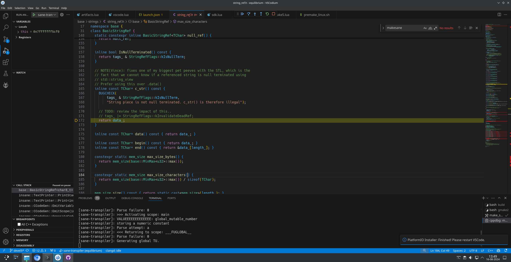

# Linux deveopment

## Linux development environment

The by far easiest and best way to get all build tools installed, is to use the nix package manager - don't worry, you don't have to switch to nixos, you can use nix on any linux distribution.

### Installing nix

To install nix, run the following command:

```bash
curl -L https://nixos.org/nix/install | sh
```

After the installation is complete, you can then simply run `nix develop` in the root of the equilibrium repository to get all the necessary build tools. This will then refresh the shell and you will have all the necessary tools available. Afterwards, you can (pre)make the build system by running `./build/premake_linux.sh <build_mode (debug, release, shipping, etc)>` in the root of the repository. The generated make files will be in the `out/<tool>` directory.

### IDE setup

For development, premake will generate the nessesary launch files for VSCode, so you can simply open the root of the repository in VSCode and start developing. Available programs are visible in the debug tab of VSCode, and full debugging should be available, as long as you have gdb installed.

Image:
